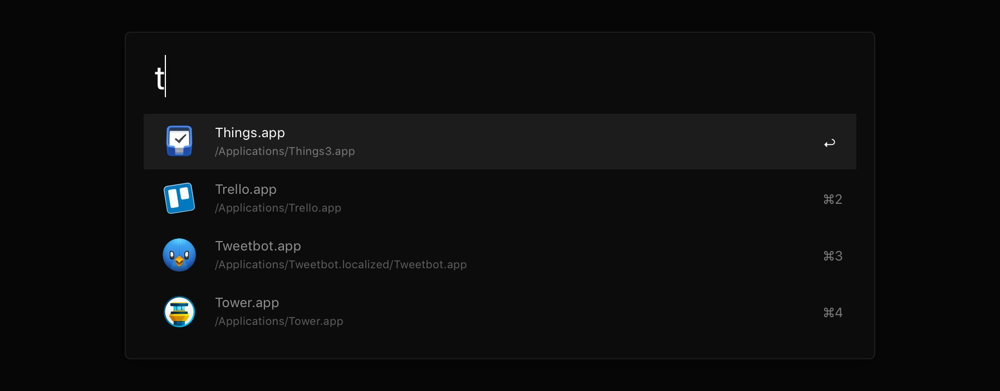

# Alfred Theme Nero



Alfred Theme Nero is a theme for [Alfred](https://alfredapp.com), initially part of the [Nero](https://github.com/lucaorio/nero) project.

Nero has been rescoped to be only an Übersicht widget for Yabai, but this old theme is made available for whoever still wants it. Please note that this repository will no longer be updated as I switched to [Raycast](https://raycast.com).


## Requirements

- [Alfred](https://alfredapp.com)


## Installation

**CLI:**

```shell
$ git clone http://github.com/lucaorio/alfred-theme-nero && cd alfred-theme-nero
$ open alfred-theme-nero/nero.alfredappearance
```

**Manual**:

- Download the [latest version](https://github.com/lucaorio/alfred-theme-nero/releases/latest)
- Unzip it
- Open the `nero-alfred` folder, and double-click `nero.alfredappearance`


## License


## Contacts

- Mastodon: [@lucaorio](http://mastodon.design/@lucaorio)
- Twitter: [@lucaorio_](http://twitter.com/@lucaorio_)
- Website: [lucaorio.com](http://lucaorio.com)
- Email: [luca.o@me.com](mailto:luca.o@me.com)
